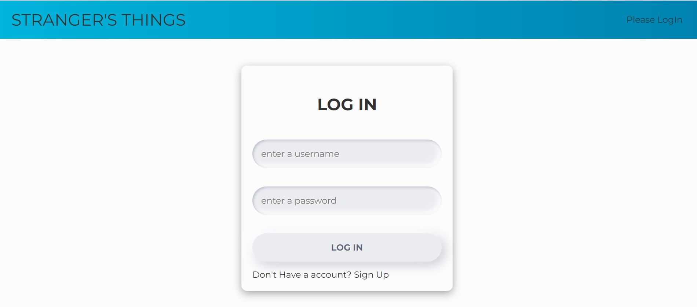
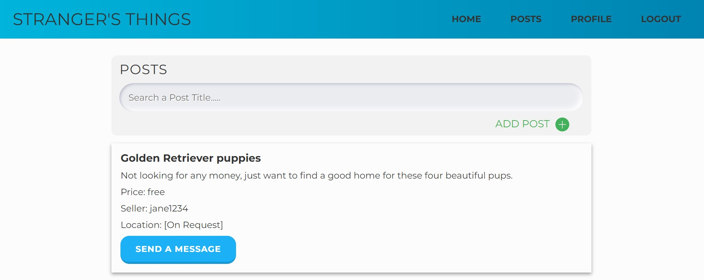
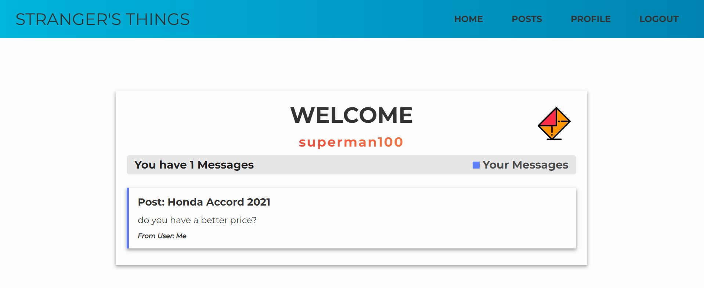

# Stranger's -Things Project

Stranger's things is a simple single page application (SPA) which was deleveloped using React & react route v6.

## Description.

These are some of the features of this SPA:

- Fetch data from a server.
- Create an account & delete an existing account.
- View posts & messages from different users.
- Create, update & delete your own posts.
- Send messages to other users.
- Markdown on your messages.
- Filter posts.
- Navigate between different pages.
- Authentication of users.
- Simple and intuitive user experience.
- and More!

### Screenshots

### `Login`

### `Posts`

### `Messages`

## Delevopers.

Stranger's -Things Project was delevoped with collaboaration of :

- Taylor Edelman.
- Benjamin Swartzwelder.
- Yeisson Giraldo C.
